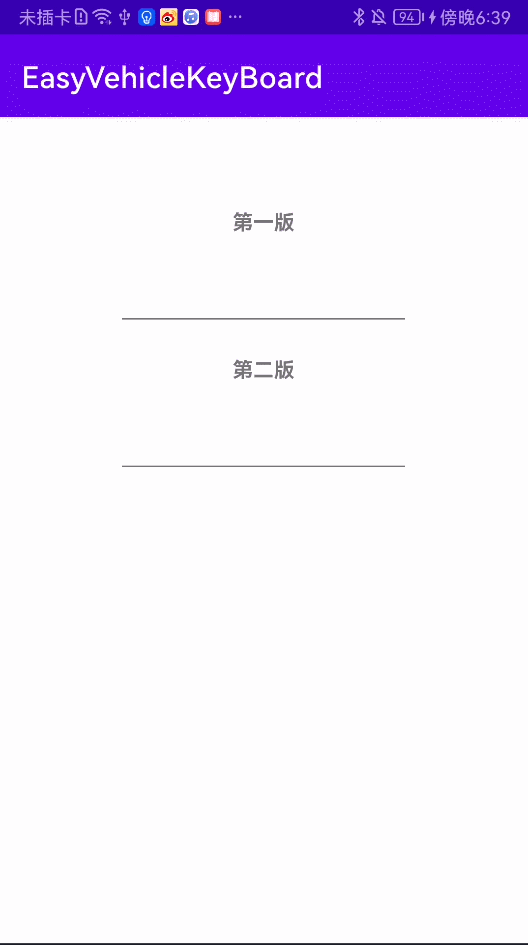

# Android原生自定义车牌输入法 EasyVehicleKeyBoard

## 包含两种实现方式

**app模块为一个建议的使用Demo**

**EasyVehicleKeyBoard 就是本项目第二种写法**

**OldVehicleKeyBoard 就是第一种写法**

## 效果图

# 说明文档及用法详见

[Android原生自定义车牌输入法 附带两种实现思路以及源码 EasyVehicleKeyBoard](https://juejin.cn/post/7122400024683626532)

